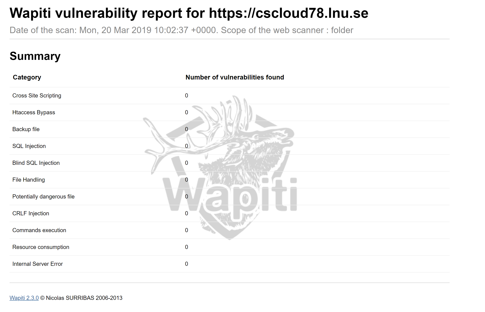

# nn222ia-examination-3

## Vad är Urlen till din applikation?

https://cscloud78.lnu.se/

### Förklara vad du har gjort för att göra applikationen säker både i koden och när du konfigurerar din applikations server?

##### Kodmässigt: 

Jag har använt mig utav helmet som default. Det innebär att man sätter olika headers som ökar säkerheten för applikationen.

Dessa är:
  
  * DNS Prefetch Control - avaktiverar webbläsarens DNS (förhämtning).
  * Frameguard - förhindrar klick-attacker, Ser till att det som är klickat verkligen tar dig till rätt länk.
  * HidePowerdBy - Döljer vilken plattform servern körs på.
  * HSTS - "Strict-Transport-Security" - förhindrar att anslutningen stannar byter protokoll från HTTPS.
  * isNotOpen - förhindrar Internet Explorer (upp till v.8) exikverar HTML från din applikation.
  * noSniff - Låter inte webbläsaren gissa MIME-type på ett dokument. En server kan annars ta emot ett .html dokument som innehåller javascript
  * xssFilter - förhindar exikvering av javascript vid expempelvis input fält. Letar efter script taggar och förhindrar dessa att exikveras.

Jag har använt mig utav helmets Content Security Policy där jag vit-listar mina egna filer och de filer som jag har lagt in på min index sida samt att jag har "blockAllMixedContent" som ser till att alla filer kommer ifrån en https sida.

På posten till github så har jag använt mig utav en middleware som ser till att jag bara tar emot posts ifrån Github. Jag läser av sha1 signaturen som jag har lagt in som en secret i webhooken och jämför den med min egna signatur för att säkerhetställa att posten inte har manipulerats.

##### På servern:

På servern så har jag lagt in att servern ska dölja vilken server som körs med genom att skriva in i conf filen sever-token Off.
Installerat SSL-certifikat från Let´s Encrypt som gör att anslutningen krypteras och körs på HTTPS.
Konfigurerat brandväggen i ubuntu som endast tillåter anslutningar över ssh(port 22), http(port 80) och https(443).
Jag har också installerat verktygen [wapiti](http://wapiti.sourceforge.net) som gör en undersökning på olika attacker och visar en rapport som jag inkluderar nedan

### Förklara följande, hur du använder dom och till vilket syfte?

* Reversed proxy - En reversed proxy är en server som sitter mellan interna applikationer och externa klienter, vidarebefordrar klientförfrågningar till lämplig server. Medan många vanliga applikationer, som Node.js, kan fungera som servrar på egen hand, har NGINX ett antal avancerade belastningsbalanserings-, säkerhets- och accelerationsfunktioner som de flesta specialapplikationer saknar. Genom att använda NGINX som reversed proxy kan du lägga till dessa funktioner i alla applikationer. Jag använder min reversed proxy till att vidarebefodra HTTP (port: 80) requests och byta protokoll till HTTPS (port: 443).

* Process manager - Process manager fungerar som en kontainer där man kan lägga upp sin produktion live. Man kan använda den till bland annat monitorering, lastbalansering,
och att den startar om servern automatiskt om den kraschar. Jag har använt mig utav den genom att lägga upp min produktion på den och att den hjälper mig att starta om.

* TLS certificates - TLS certifikat tillåter dig att använda dig utav HTTPS vilket gör det möjligt att kryptera datan som skickas mellan klient och server. Jag har använt
mig utav Let´s Encrypt och deras Certbot klient för att installera detta på servern.

* Environment variables - Dessa variabler finns i den .env fil i produktionen, Jag använder mig utav environment variabler för att lagra känslig information som jag inte vill pusha upp till mitt repositorie. Jag läser in min .env fil med hjälp utav modulen 'dotenv'.

### Vad är skillnaden när du kör din applikation i produktion jämfört med utveckling?

I början så var detta ett problem när jag skulle koppla upp mig hela tiden. Varje gång jag gjorde en ändring var jag tvungen att pusha upp till production och i längden var inte detta hållbart tills jag hittade ngrok som hjälper mig att arbeta som om applikationen var i produktion.

Den enda skillnaden är att jag byter vilken url webhooken på github ska lyssna på.

### Vilka extra moduler har du använt under examinationen? Motivera varför och hur du använt dom och om dom är säkra.

Jag tog med alla mina installerade moduler i detta. Kanske lite överdrivet att ta med express, express-hbs, socket.io, body-parser och helmet eftersom de är erkända och välkända moduler som ständigt uppdateras och har flera användare i veckan. Men jag tog med dessa ändå och gjorde såklart research på dessa ändå.

Alla moduler ser man om dom har kända säkerhetshål när man kör npm install då körs även npm audit som kollar igenom paketen och varnar ifall det finns säkerhetshål.

Jag har använt mig utav följande moduler:

* express - Används för att skapa en server. 
  Över 7,5 milj nedladdningar i veckan och ofta uppdaterad gör mig trygg att detta är en säker källa.
* express-hbs - Används för att skapa dynamik på min webbplats.
  20 tusen nedladdningar i veckan. Uppdaterad nyligen och finns flera versioner av den.
* helmet - Används för att förbättra säkerheten i applikationen.
  Över 450 tusen nedladdningar och uppdaterad för någon dag sedan.
* body-parser - Används för att parsa data som kommer från req.body.
  7,8 milj nedladdningar och uppdaterad 10 mån sedan och har funnit i 64 versioner.
* dotenv - Används för att läsa in .env variabler.
  5.1 milj nedladdningar och uppdaterad några dagar sedan och finns i 35 versioner.
* crypto - Används för att skapa hashning på min secret och jämföra signaturerna mellan servern och github.
  Inbyggd modul i node.js. Eftersom jag bara använder denna till att skapa och jämföra signatur så finns ingen säkerhetsrisk i att jag använder denna. Många förespråkar Bcrypt istället och jag kan hålla med om att den är säkrare men just i mitt fall så räcker det med den inbyggda modulen.
* socket.io - används för att skapa en webbsocket anslutning till klienten.
  Nästan 2,5 milj nedladdningar i veckan. Uppdaterad för 4 månader sedan och finns i över 100 versioner.
* node-fetch - Används för att hämta data från mitt repo på github, jag hämtar både öppna och stängda issues.
  Över 8 milj nedladdningar i veckan. Uppdaterad för 4 månader sedan och över 40 versioner.
* wapiti - Avänds på servern i rent test syfte för att titta efter säkerhetshål
  paketet har fått goda betyg på [Source forge](https://sourceforge.net/p/wapiti/news/2018/05/wapiti-301/)
* production - används för att pusha upp ändringar till produktionsmiljön.

### Har du implementerat några extra features som kan motivera högre betyg?

* Notifikationer - 
  Jag har implementerat att sidan använder sig utav "pop-up" notifikationer när ett event triggas från github. En grön blinkande box med notifikation om vad som har inträffat, vem som har gjort ändringen och vad för ändring och skriver ut kommentaren.

* Använder eget certifikat - 
  Jag använder ett eget certifikat genom Let´s Encrypt.

* Ytterliggare testat SSL -
  Jag har kontrollerat att kryptering på webplatsen med hjälp utav [Qualys SSL Labs](https://www.ssllabs.com/) där jag fick en rapport som jag har i en pdf (SSL-Server-Test.pdf) i repot.